# **Testing Quiz Game**

- ## Testing User Experience and Stories (UX)

- First time visitor goals: 
    - As a first time user/player of the web base game,  I want to be able to navigate through  the site quick and understand everything at first glance.  

        1. The visitor will enter the site and have a simple and clean site to read and follow.
        The is just two option to pick from to move forward in the game.  Instructions and Play Game.

        2. On clicking the instruction button the rules of the game will appear and will explain how to play.  The instruction will be a model so the user/player will know were they are in the website/game.  The model will have a simple X at the top right corner to close the instruction tab.

        3. Click play will start the game and switch the screen to game stage.

    - As a first time user/player I want to understand what it I looking at and what I can interact with.

        1. The user/player will have a simple and uncluttered display with all the informaiton and visual in the center of the screen, reading from top to bottom.

        2. The simple display will be intuitive and the user/player will know what they are looking at, at first glance.  They will know what to click on.

        3. The display will use a font that everyone is familiar with and easy to read.

    - As a user/player I want to know how much time I have left to answer the question.

        1. A the bottom of the page the will be a countdown timer which is counting down from 60 second.  This is just underneath the 4 answer choices so will be in the user/player eyesight at all time when pick a answer.

        2. Once the timer hit "0" the game will automatic finish and the user/player will be taken to the score page.

    - As a user/player I would like to know if the answer to the question is right.

        1. Once the user/player has click a answer the right answer will flash up for about 3 second given they a chance to acknowledge the right answer and to educate the player on the country's flag.

        2. If the player hit the wrong answer, a alert message will pop up saying it was the wrong answer and then the answer will flash up before switching to the next question.

    - As a user/player I want to know what question I am on.

        1. The will be a quesiton number indication at the top center of the page just above the question and image.  So the  user/player will see and be able to  acknowledge the indicate when reading the question.

        2. This will automatic change after each question.

    - As a user/player I would like to know how well I play the game.

        1. Once the game has finish the user/player will be transport to the score page.  Here the user/player will be given two  different way to see there score. First is at the top of the page with just the score it's self.  This is display just like the the display of which question the player was on. This is to help with familiarity to the player and speed up the reading of the game.

        2. Second is just under the score indicate at the top and gives more detail by saying "this is your score".

        3. The player can then choose if she/he would like to score the score.  The save form is easy to see and workout how it works without having to user any instruction.  Enter name and save!  The enter name is a input bar and says in the bar "Enter your name", and just below that is the save button.

        4. The user/player can also check out the top score by hit the highest score button which brings up a modal with the scores. This will sort the top 5 best scores.  At the end of the list and user/player will see a "X" button which is universal sign to close the modal.

    - As a user/player I would like to know how to restart the game again so I can try and better my last attempt.

        1. A the  bottom of the page the is a clear button reading "Home" which will take the user/player back to the start so they can play the game again.

- Returning user/player goals:
    - As a returning user/player I would like to better my score.

        1. As the top scores are save to local store a player can come back in and try to better it.

        2. A user/player will also be able to see other player score that have play the game on the same device in the highscore table screen. This will giving it a competitive feel.

    - As a returning user/player I dont't want to find it boring after a few trys.

        1. The game has a big array of question which will tax the user/player every time they play the game.

        2. The question are pick randomly so the sequence on which the question appear will be different everytime you play the game.  Once the question is user the game will remove it from that play game so you can't see the same question twice in one turn.

# Bugs issues and solutions

## Timer still running on score page

- On the end screen to display the score, the timer was still initiating long after the game had finish.  This was caught when building the scoreRankings functions. To fix this I read through the code and try to figure out the area that was causing the problem.  I identify several area but didn't know which one was initiating from.  So I console.log different error message in the code to see which point it was from.

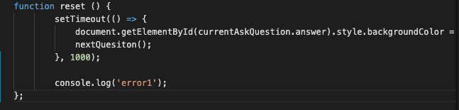
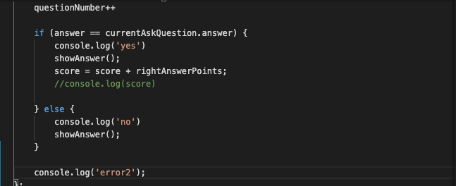
[commit-point](https://github.com/Craigharrison79/MS2-Quiz-Game/commit/373d93346ba5343d9eaa981a9e7ec38f8ba23510)

Once found the  initiating error I could trace my steps till I workout the problems.  I remove the clearInterval(timer = 10 + 1) from both the countDown and reset function.

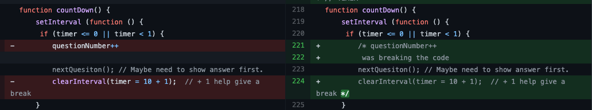
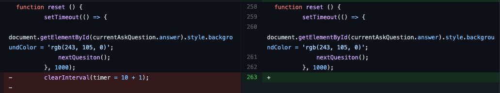

Then adding the code to a else statment in the next question function. This fix the problem.

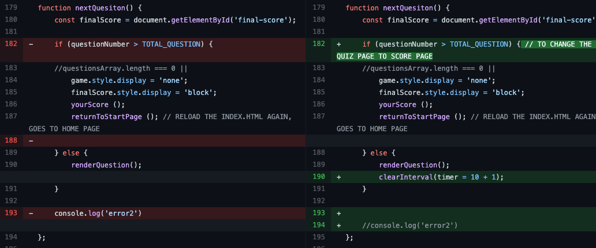

## Timer issue again

- Once I add a alert message to the game the timer started to run into the negative numbers.  I fix this by add a global variance "x" and then changing the clearInterval to take "x".  Also adding a extra bit to the if statement to acknowledge when the timer had run down to 0 and then finish the game.  This change fix the negative number problem but caused a second one.  See below.

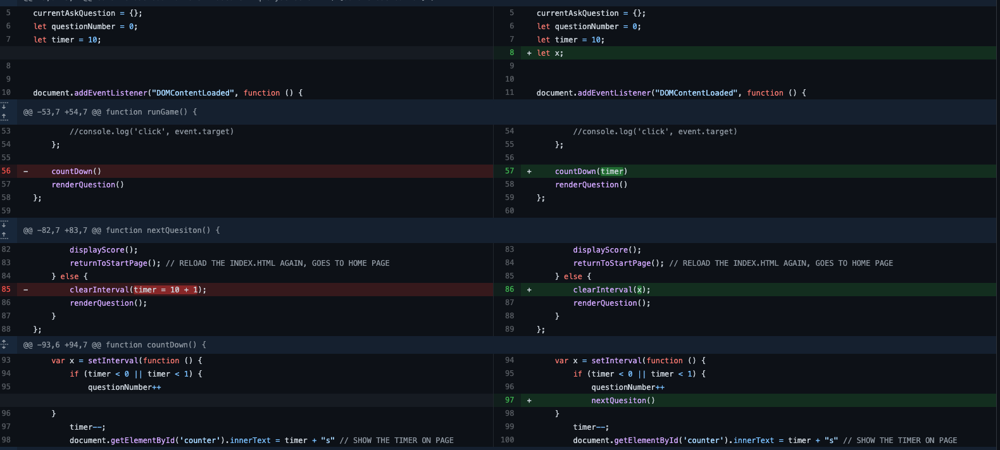

## Second issue with timer

- After the fix the timer was not looping over again.  10 seconds of question one and then 10 seconds for two etc.  I try calling the countdown() at different time and places but this just sent the timer heywire, jumping and skipping numbers.  So I made a executive decision to change the timer from 10 second interval to one long timer running for 60 second through the whole game.  10 question at 10 second a piece is 60 seconds which is the same thing.  This also mean the question a user/player know they can save on time and use them for harder question.

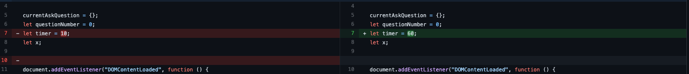
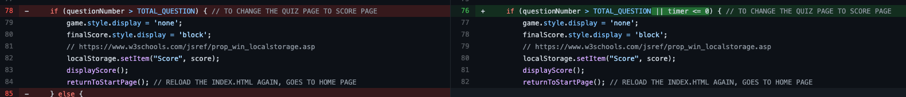
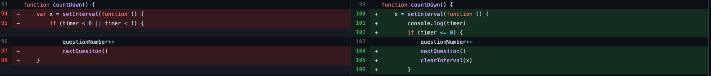

## Show Answer to Player

I had a issue once the answer was shown to the player that it change to color of the answer box and didn't return back to it's original color when moving to the next question.  Reading my Javascript book JAVASCRIPT & JQUERY BY JON DUCKETT which help me with setTimerout function. This fix the issue.

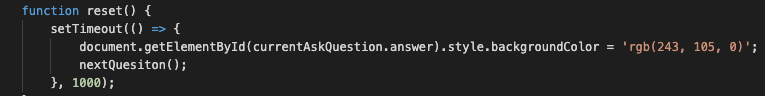

## High Score Table/list

I wanted to build a table to hold the highest score in and present they.  I could build the table but couldn't not figure out the code to get the score to insert into the table using map function.  I change to a unorder list.  This is something I need to came back to and figure out at a little date.  But with time being sensitive at the moment of the project I opted for the faster version.

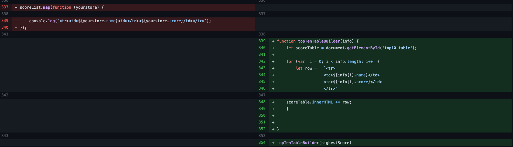
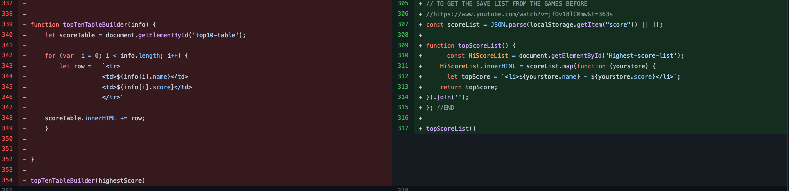

## Home button

I was having issue with the home button and the site going to 404 page everytime I try to use it on git page.  In the editor everything was fine and working properly but once I published it in on git page the issue started.  My Mentor: Oluwafemi Medale help me with this.  I was using the first image and should have use /index.html but this was still not working why I dont know but I added a dot the the start and this fix the issue.

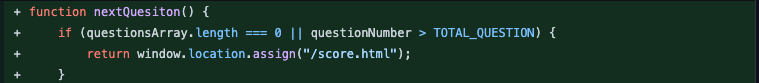
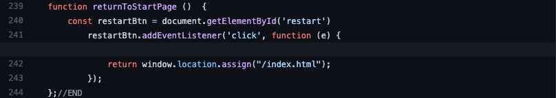
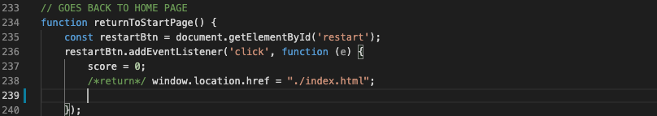

## SVG problems

I have use two SVG images that is put together in figma. I the editor everything was working fine, I didn't have a problem till publishing the game.  Then the image wouldn't show up. I couldn't find out how to fix the issue so I just when to a PNG and this work fine.

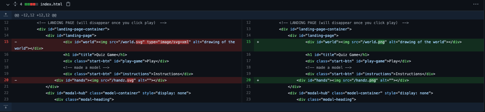

## Local storage issue

Had a issue with the score being save and also the score splicing so it is just the top five scores.  I ask my mentor for help with this but he couldn't help me.  This was hard to hear as I need help with it, I was working on it for days without any futher progress.  I decide to remove the whole code and rewrite it again. This time I had sucess. Can't say what fix the issue but this work.

[link here to read code](https://github.com/Craigharrison79/MS2-Quiz-Game/commit/4ee0280e4b43b6c475d3eec452085d192c4f3e2a#diff-4698a0d6946cc7eab0ee49f1773e6bfa66a91c8c1ae37b2587b9dc9ebdf47247L148)

# Testing on devices

Testing was done on different elements to see how the site preforms and the responsiveness of the site.

Browsers:

- Chrome, Firefox, Safari and Opera.

No problems with any of the browsers I test on.

Devices:

- Mac (Macbook), Ipad and Iphone 11 and using developer tools in Chrome: (Moto G4, Galaxy S5, Pixel 2, iPad Pro,
Surface Duo).

### Responsiveness on devices.

With the responsiveness being viewed through different devices and different screen sizes, changes had to be made.

- Galaxy fold: Issue on landscape when folded and also on portrait when unfolded.
- Surface Duo: Breaks when unfolded
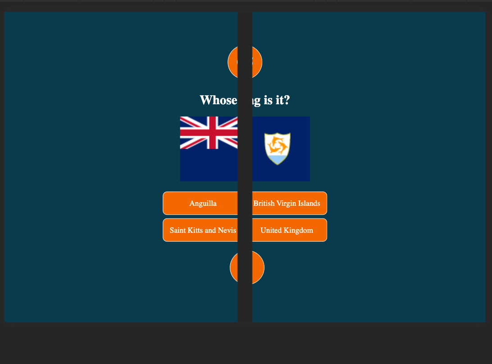
- iPhone 5/SE: Break on lower screen when ask quesitons
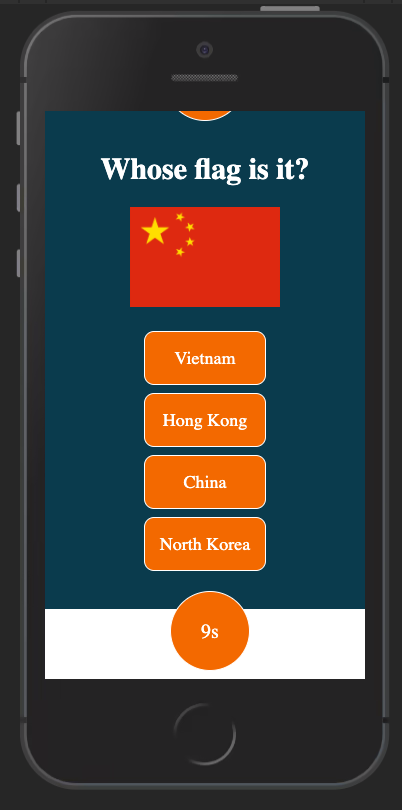

- **Issue:**

> - Artwork needed resizing on different sie screen.
> - Artwork on phone landscape, remove world image from landscape to make everything fix better.
> - Landscape game features did not fix on page without the background breaking. Fix this by add .main-conatainer: height: auto !important.
> - Look of question on big screens.  Use grid-template-columns: repeat(2, auto) on big screen to give the quesion a more game show look.

# Accesibility

Wave Report showed the following issues:

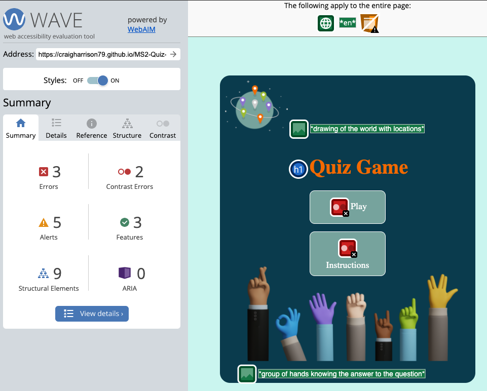

#### Missing label

I added a label to the form input box and then display: none to hidden it from the screen veiw.

#### Contrast Error

I had some contrast errors with the text on the buttons. To fix this I would have to take the text colour to black or darken the button colour to fix the issue. If I darken the button the contrast bewteen the background and the button is not enough to make the button pop or I have to change my colour style.  So it leaves me with just changing the text colour to black and I didn't want to do this as I think the white colour looks better.

#### No page regions

As this is a game and I don't need a header, I fix this by placing a header with a link to the main section and then display: none to the header. This fixes the alert.

#### Empty heading

Just added text to fix this.

#### Event handler Alerts

I have a alert on 4 event handler all to do with the answer choices.  This need a keyboard fix but as I had a issue with this before I didn't want to play around with it and set me back just before handing in the project.  This is something I need to look at again and fix later on.  I also thinking about this in the next projects so this don't happen again.

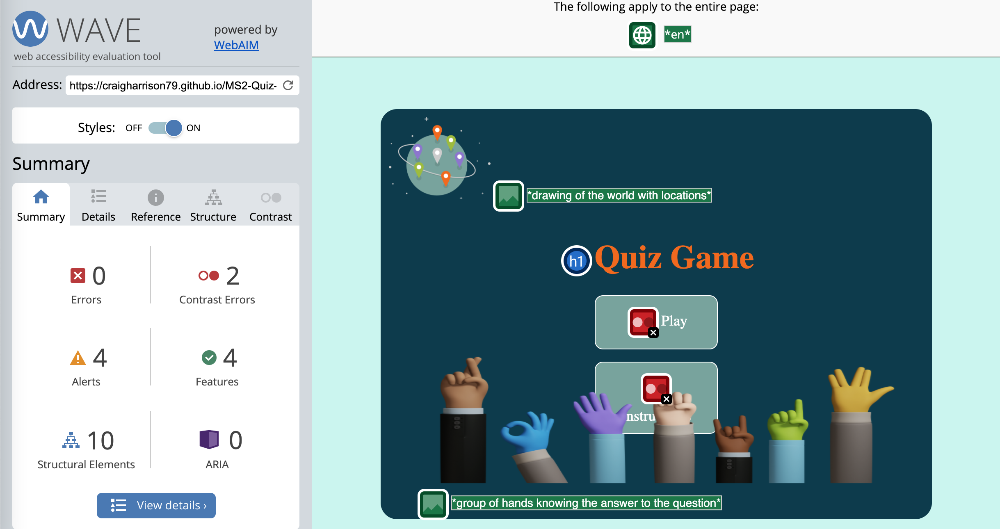

# Google lighthouse

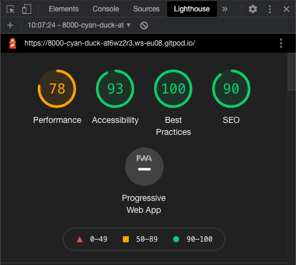

### To improve the rating scores

#### Performance

-  100% rating so great could do maybe some small changes if I need to.

#### Accesibility

- Contrast ratio

Same as the Wave Report, contrast issue on the buttons.  I could change it to black and fix the problem but I like it white so I am optin to keep this white as its still 95% accessibility rate.

#### Best Practices

- I change the handz image from 821 x 369 to a 411 x 185. This should maybe be a 252 x 160 but I like to have a little wiggle room for the increased screen size.  Plus at 87% this is a good rating on mobile and decktop is at 100%.

#### SEO

- This was good recording to the report.

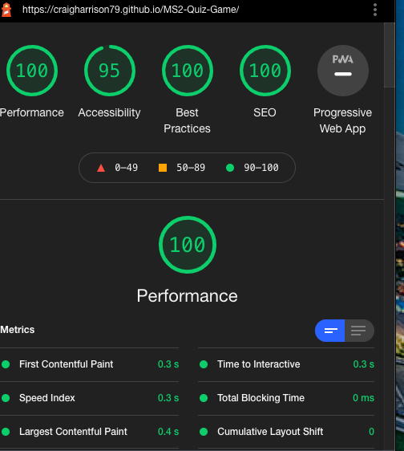

This is becasue of the high aspect ratio.

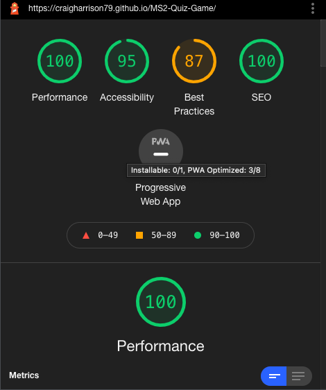

# HTML & CSS Validation

## W3C Markup CSS Validation

### HTML CHECKER

- first two error are empty heading.
- third error is a duplicate attribute class.

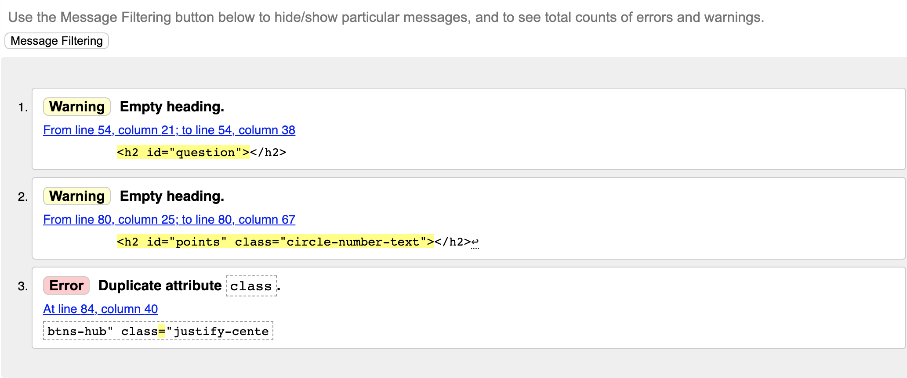
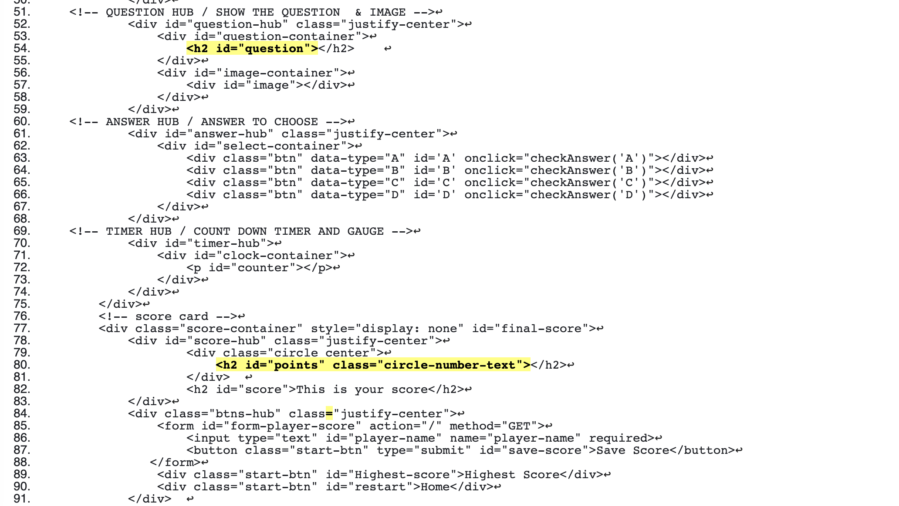

- Just removing the second class some no duplicate.

### CSS CHECKER

- No error

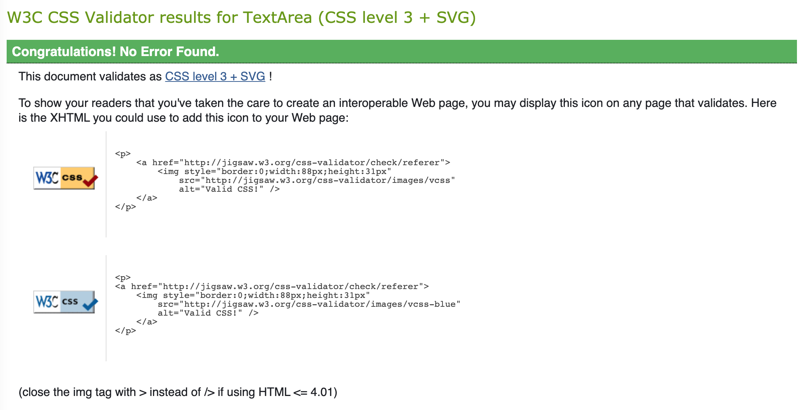

### JS HINTS

- Lots of this statment:
    - 'const' is available in ES6 (use 'esversion: 6') or Mozilla JS extensions (use moz).

    - let' is available in ES6 (use 'esversion: 6') or Mozilla JS extensions (use moz).

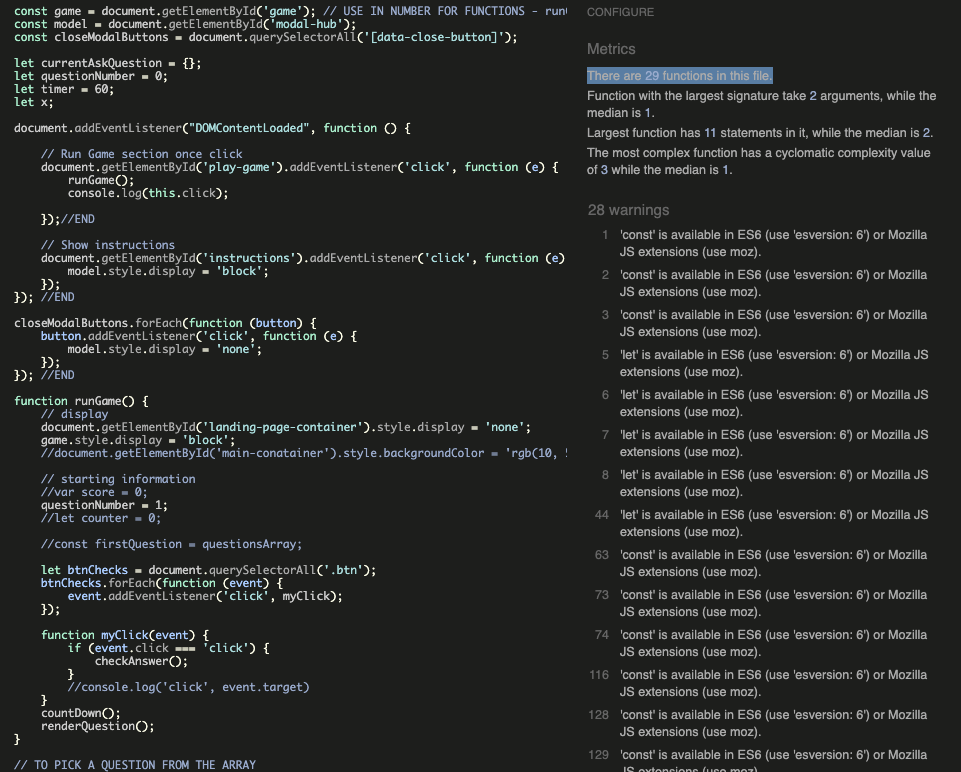

